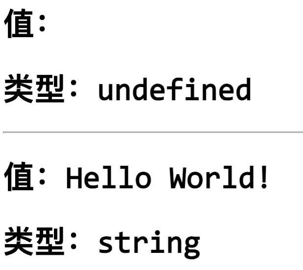
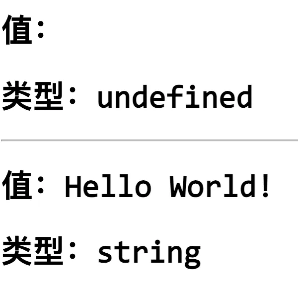
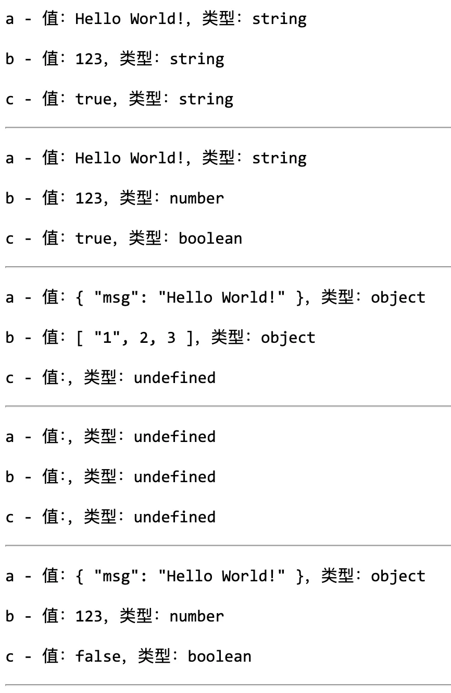
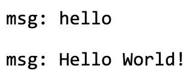
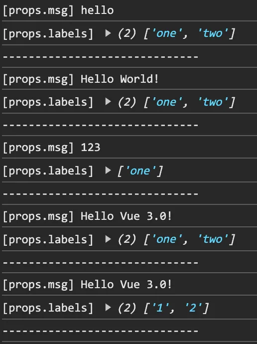
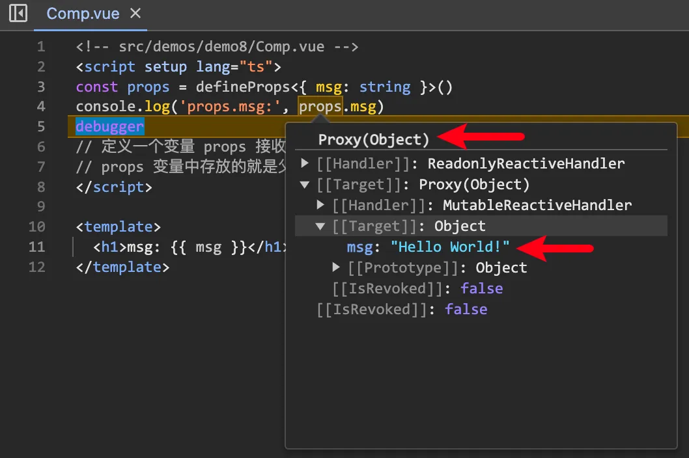
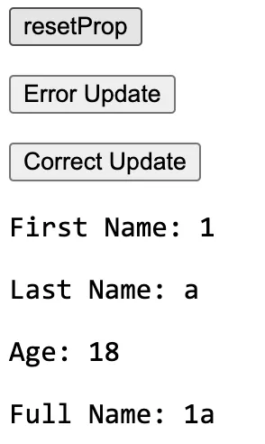
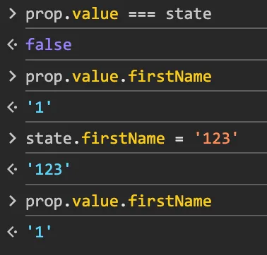
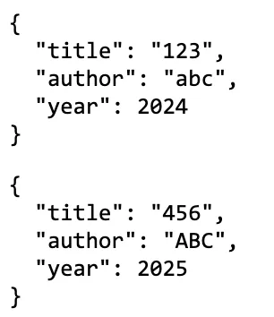
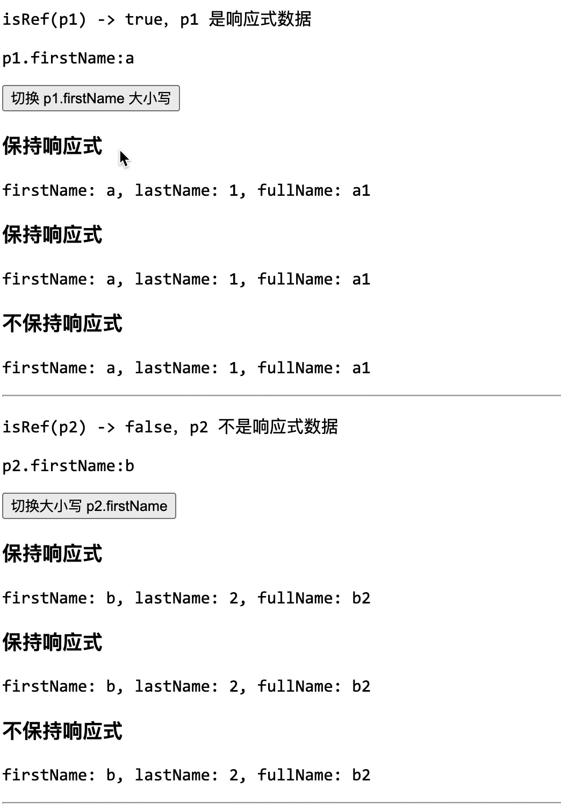

# [0001. 属性](https://github.com/Tdahuyou/vue/tree/main/0001.%20%E5%B1%9E%E6%80%A7)


## 📝 summary

- 运行时声明（runtime declarations）
- 基于类型的声明（type-based declarations）
- Prop 命名规范
- v-bind 传递整个对象
- 单向数据流
- demo - 属性声明
  - 使用泛型声明 props
  - 可选属性
  - 属性默认值（runtime declarations）配置 default
  - 属性默认值（type-based declarations）编译宏 withDefaults
  - 使用类型别名声明 props
  - 使用接口声明 props
  - 使用对象式声明 props
  - 使用对象简写声明 props
  - 使用数组简写声明 props
  - 声明多个 props
  - 为单个 prop 指定多种可能的类型
  - 使用 v-bind 一次性传递多个 prop
- demo - 属性访问
  - 在 script setup 中访问使用 defineProps 定义的 props
  - 在非 script setup 中访问 props
  - 在模板 template 中访问使用 defineProps 定义的 props
- demo - 属性校验
  - prop 校验
  - validator 配置
  - watch
- demo - PropType 细化类型
  - 使用 PropType 在运行时声明（runtime declarations）中细化类型
- demo - toRefs 保持属性的响应式状态
  - 直接解构 props，会导致响应式丢失
  - 在解构 props 时，可以使用 toRefs **保持** 属性的响应式状态

在本节的示例中，都有对应的视频讲解，通过多个 demo 来了解有关 props 的相关内容。

## 🔗 links

- https://cn.vuejs.org/guide/typescript/composition-api.html
  - Vue，TypeScript，TS 与组合式 API。
- https://cn.vuejs.org/guide/components/props.html
  - Vue，深入组件，Props。
- https://cn.vuejs.org/api/utility-types.html#proptype-t
  - Vue，进阶 API，TypeScript 工具类型。

## 📺 video - 视频概述

| 标题     | 简述                                                                                   |
| -------- | -------------------------------------------------------------------------------------- |
| 属性声明 | 在 `<script lang='ts' setup>` 中，如何声明 props。                                     |
| 属性访问 | 如何在 `<script>` 和 `<template>` 中访问 props。                                       |
| 属性校验 | 介绍 validator 字段；介绍如何不用 validator，使用 watch 来监听 props，自定义校验规则。 |
| PropType | 介绍 PropType 的应用场景 - 细化类型                                                    |
| toRefs   | 介绍 toRefs 的应用场景 - 解构 props 时保持响应式                                       |

> 视频录制的时候正好刚跑完步，喝着雪碧，所以会时不时有点儿打嗝的声音。

## ❌ error - 错误说明

- 在 Props 系列的视频中 `declarations`（声明 `/ ˌdekləˈreɪʃnz /`） 这个单词的发音错误，读成了 `direction`（方向 `/ daɪˈrekʃn /`）。

## 📒 notes - 属性 - 运行时声明 vs. 基于类型的声明

- Q：**什么是“运行时声明”（runtime props declarations）、“基于类型的声明”（type-based props declarations）？**
- **“运行时声明”（runtime props declarations）**

```vue
<script setup lang="ts">
const props = defineProps({
  foo: { type: String, required: true },
  bar: Number
})

props.foo // string
props.bar // number | undefined
</script>
<!--
上述写法被称之为“运行时声明”（runtime props declarations）
因为传递给 defineProps() 的参数会作为运行时的 props 选项使用。
-->
```

- **“基于类型的声明”（type-based props declarations）**

```vue
<script setup lang="ts">
const props = defineProps<{
  foo: string
  bar?: number
}>()
</script>
<!--
上述写法被称之为“基于类型的声明”（type-based props declarations）
编译器会尽可能地尝试根据类型参数推导出等价的运行时选项。

在这种场景下
该例子中编译出的运行时选项和上一个是完全一致的
即，两种写法是等效的

这两种声明方式，在本节的 demo 中都会介绍。
如果想要更好地结合 TS 的类型系统，让方便类型被更好地复用，
type-based props declarations 是更好的选择。
-->
```

- 由此可见，type-based 是定义属性的另一种写法，它和 runtime 式写法都是一样的，都是用来声明 props，并没有扩展任何额外的功能，因为 **type-based 式写法，最终是会被编译器推断为 runtime 式写法。**

## 📒 notes - 属性 - `defineProps()` 宏中的参数不能是变量

- `defineProps()` 宏中的参数 **不可以** 访问 `<script setup>` 中定义的其他变量，因为在编译时整个表达式都会被移到外部的函数中。

## 📒 notes - 属性 - Prop 命名规范

- 子组件定义 props 的时候，属性名建议采用小驼峰式写法，比如 `greetingMessage`。
- 父组件在调用子组件并传递 props 时，属性名建议和 HTML 的 attribute 写法对齐，采用中划线式写法，比如 `greeting-message`。

```ts
defineProps({
  greetingMessage: String
})
// 如果一个 prop 的名字很长，应使用 camelCase 形式，
// 它们是合法的 JavaScript 标识符
// 可以直接在模板的表达式中使用
// 也可以避免在作为属性 key 名时必须加上引号

// 在模板中
// <span>{{ greetingMessage }}</span>

// 虽然理论上你也可以在向子组件传递 props 时使用 camelCase 形式
// 但实际上为了和 HTML attribute 对齐，我们通常会将其写为 kebab-case 形式

// 在父组件中
// <MyComponent greeting-message="hello" />

// 对于组件名我们推荐使用 PascalCase，
// 因为这提高了模板的可读性，
// 能帮助我们区分 Vue 组件和原生 HTML 元素。

// 然而对于传递 props 来说，
// 使用 camelCase 并没有太多优势，
// 因此我们推荐更贴近 HTML 的书写风格。
```

## 📒 notes - 属性 - 静态 vs. 动态 Props

- 动态属性可以通过 `v-bind` 来传。

```vue
<!--
静态形式的 props
-->
<BlogPost title="My journey with Vue" />

<!--
动态形式的 props
使用 v-bind 或缩写 : 来进行动态绑定的 props
-->
<!-- 根据一个变量的值动态传入 -->
<BlogPost :title="post.title" />

<!-- 根据一个更复杂表达式的值动态传入 -->
<BlogPost :title="post.title + ' by ' + post.author.name" />
```

## 📒 notes - 属性 - 传递不同的值类型

```vue
<!-- Number -->
<!-- 虽然 `42` 是个常量，我们还是需要使用 v-bind -->
<!-- 因为这是一个 JavaScript 表达式而不是一个字符串 -->
<BlogPost :likes="42" />

<!-- 根据一个变量的值动态传入 -->
<BlogPost :likes="post.likes" />


<!-- Boolean -->
<!-- 仅写上 prop 但不传值，会隐式转换为 `true` -->
<BlogPost is-published />

<!-- 虽然 `false` 是静态的值，我们还是需要使用 v-bind -->
<!-- 因为这是一个 JavaScript 表达式而不是一个字符串 -->
<BlogPost :is-published="false" />

<!-- 根据一个变量的值动态传入 -->
<BlogPost :is-published="post.isPublished" />


<!-- Array -->
<!-- 虽然这个数组是个常量，我们还是需要使用 v-bind -->
<!-- 因为这是一个 JavaScript 表达式而不是一个字符串 -->
<BlogPost :comment-ids="[234, 266, 273]" />

<!-- 根据一个变量的值动态传入 -->
<BlogPost :comment-ids="post.commentIds" />


<!-- Object -->
<!-- 虽然这个对象字面量是个常量，我们还是需要使用 v-bind -->
<!-- 因为这是一个 JavaScript 表达式而不是一个字符串 -->
<BlogPost
  :author="{
    name: 'Veronica',
    company: 'Veridian Dynamics'
  }"
 />

<!-- 根据一个变量的值动态传入 -->
<BlogPost :author="post.author" />
```

## 📒 notes - 属性 - `v-bind` 一次传递整个对象

```vue
<script>
// 示例
const post = {
  id: 1,
  title: 'My Journey with Vue'
}

// 如果你想要将一个对象的所有属性都当作 props 传入，
// 你可以使用没有参数的 v-bind，
// 即只使用 v-bind 而非 :prop-name。
</script>
<template>
  <!-- 写法 1（更简洁） -->
  <BlogPost v-bind="post" />
  <!-- 写法 2 -->
  <BlogPost :id="post.id" :title="post.title" />

  <!-- 写法 1 和 写法 2 是等效的-->
</template>
```

## 📒 notes - 属性 - 单向数据流

- 所有的 props 都遵循着 **单向绑定** 原则，props 因父组件的更新而变化，自然地将新的状态向下流往子组件，而不会逆向传递。这避免了子组件意外修改父组件的状态的情况，不然应用的数据流将很容易变得混乱而难以理解。
- 另外，每次父组件更新后，所有的子组件中的 props 都会被更新到最新值，这意味着你不应该在子组件中去更改一个 prop。若你这么做了，Vue 会在控制台上向你抛出警告：

```ts
const props = defineProps(['foo'])

// ❌ 警告！prop 是只读的！
props.foo = 'bar'
// props 是来自父组件的数据，作为子组件，你只有读的份。
// 虽然 JS 的引用传值的特性让你拥有了修改来自父组件数据的能力。
// 但是这种能力最好不要在这里去用，否则会破坏单向数据流。
```

- 导致你想要更改一个 prop 的需求通常来源于以下两种场景：
  - **【场景 1】prop 被用于传入初始值；而子组件想在之后将其作为一个局部数据属性。**在这种情况下，最好是新定义一个局部数据属性，从 props 上获取初始值即可：
  - **【场景 2】需要对传入的 prop 值做进一步的转换。**在这种情况中，最好是基于该 prop 值定义一个计算属性：

```ts
// 【场景 1】
const props = defineProps(['initialCounter'])

// 计数器只是将 props.initialCounter 作为初始值
// 像下面这样做就使 prop 和后续更新无关了
const counter = ref(props.initialCounter)
// 修改 counter 不会影响到 props.initialCounter 的值


// 【场景 2】
const props = defineProps(['size'])

// 该 prop 变更时计算属性也会自动更新
const normalizedSize = computed(() => props.size.trim().toLowerCase())
```

### 引用类型 - 更改对象 / 数组类型的 props

- 当对象或数组作为 props 被传入时，虽然子组件无法更改 props 绑定，但仍然可以更改对象或数组内部的值。这是因为 JavaScript 的对象和数组是按 **引用** 传递，对 Vue 来说，阻止这种更改需要付出的代价异常昂贵。
- 这种更改的主要缺陷是它允许了子组件以某种不明显的方式影响父组件的状态，可能会使数据流在将来变得更难以理解。在最佳实践中，你应该尽可能避免这样的更改，除非父子组件在设计上本来就需要紧密耦合。在大多数场景下，子组件应该抛出一个事件来通知父组件做出改变。

### 小结

- **无论是什么场景，始终记得不要去破坏单向数据流**。对于不同的场景有不同的处理方案，其核心思想在于：
  - 如果你确实有修改属性值的需求，请 **拷贝** 一份数据出来再去修改。
  - 或者将改动行为封装成一个 **事件**，通过通知父组件的方式来触发值的修改（在子组件中通知，值的修改还是发生在父组件中）。

## 📒 notes - 示例切换说明

```js
// src/main.ts
import { createApp } from 'vue'
import App from './demos/demo1/App.vue'
// import App from './demos/demo{n}/App.vue'
// 通过改变 n 来切换不同的 demo

createApp(App).mount('#app')
```

## 💻 demo1 - 属性声明 - 使用泛型声明 props

```vue
<!-- src/demos/demo1/Comp.vue -->
<script setup lang="ts">
defineProps<{ msg: string }>()
// 约束
// msg 是 string 类型
// msg 是必填的

// 这种方式利用 TypeScript 的泛型来定义 props 的类型，简单直观。
// 适合简单类型的 props 定义，写起来比较简洁，且属性类型清晰。
</script>

<template>
  <h1>msg: {{ msg }}</h1>
</template>
```

```vue
<!-- src/demos/demo1/App.vue -->
<script setup lang="ts">
import Comp from './Comp.vue'
</script>

<template>
  <Comp msg="Hello World!" />
</template>
```


## 💻 demo2 - 属性声明 - 使用泛型声明可选的 props（type-based）

```vue
<!-- src/demos/demo2/Comp.vue -->
<script setup lang="ts">
defineProps<{ msg?: string }>()
// 约束
// msg 是 string 类型

// demo1 中的写法，相当于定义了一个必填的 msg 属性，并且要求类型为 string。
// 如果想要表达这是一个可选属性，和 TS 中的做法是一样的，只需要加一个问号即可。
</script>

<template>
  <h1>值：{{ msg }}</h1>
  <h1>类型：{{ typeof msg }}</h1>
</template>
```

```vue
<!-- src/demos/demo2/App.vue -->
<script setup lang="ts">
import Comp from './Comp.vue'
</script>

<template>
  <Comp />
  <hr />
  <Comp msg="Hello World!" />
</template>
```



## 💻 demo3 - 属性声明 - 使用类型别名声明 props

```vue
<!-- src/demos/demo3/Comp.vue -->
<script setup lang="ts">
type Props = {
  msg: string
}
defineProps<Props>()
// 约束
// msg 是 string 类型
// msg 是必填的

// 类型别名提供了一种结构化的方式来定义 props 类型。
// 适合需要复用类型定义的情况，可以定义复杂的类型结构，便于复用。
</script>

<template>
  <h1>msg: {{ msg }}</h1>
</template>
```

```vue
<!-- src/demos/demo3/App.vue -->
<script setup lang="ts">
import Comp from './Comp.vue'
</script>

<template>
  <Comp msg="Hello World!" />
</template>
```


## 💻 demo4 - 属性声明 - 使用接口声明 props

```vue
<!-- src/demos/demo4/Comp.vue -->
<script setup lang="ts">
interface Props {
  msg: string
}
defineProps<Props>()
// 约束
// msg 是 string 类型
// msg 是必填的

// 接口声明类似于类型别名，但更适用于面向对象编程风格。
// 适合复杂类型的定义和继承，支持接口继承和扩展，结构更清晰。
// 如果想要使用 TS 中接口的一些特性，比较适合使用这种声明方式。
</script>

<template>
  <h1>msg: {{ msg }}</h1>
</template>
```

```vue
<!-- src/demos/demo4/App.vue -->
<script setup lang="ts">
import Comp from './Comp.vue'
</script>

<template>
  <Comp msg="Hello World!" />
</template>
```


## 💻 demo5 - 属性声明 - 使用对象式声明 props

```vue
<!-- src/demos/demo5/Comp.vue -->
<script setup lang="ts">
defineProps({
  msg: {
    type: String,
    required: true,
  },
})
// 约束
// msg 是 string 类型
// msg 是必填的

// 对象式声明提供了更详细的配置选项，如类型、默认值和验证规则等配置项。
// 在需要详细配置 props 的场景下，这种写法是特别常见的。
// 相对于其它写法，对象式声明 props 支持更多选项，灵活性高。
// 对象声明也有简化版，只需要写明一个类型信息即可，详情见 demo6。
</script>

<template>
  <h1>msg: {{ msg }}</h1>
</template>
```

```vue
<!-- src/demos/demo5/App.vue -->
<script setup lang="ts">
import Comp from './Comp.vue'
</script>

<template>
  <Comp msg="Hello World!" />
</template>
```


## 💻 demo6 - 属性声明 - 使用对象简写声明 props

```vue
<!-- src/demos/demo6/Comp.vue -->
<script setup lang="ts">
defineProps({
  msg: String,
})
// 等效
// defineProps({
//   msg: {
//     type: String
//   },
// })

// 约束
// msg 是 string 类型

// 这是对象简写形式是对象式声明的简化版。
// 适用于简单类型的快速声明。
// 相较于 demo5，这种写法更加简洁明了，代码量更少。

// 注意
// key 键是 prop 的名称；
// val 值是该 prop 预期类型的构造函数，不要误将 String 写为 string。
</script>

<template>
  <h1>值：{{ msg }}</h1>
  <h1>类型：{{ typeof msg }}</h1>
</template>
```

```vue
<!-- src/demos/demo6/App.vue -->
<script setup lang="ts">
import Comp from './Comp.vue'
</script>

<template>
  <Comp />
  <hr />
  <Comp msg="Hello World!" />
</template>
```



## 💻 demo7 - 属性声明 - 使用数组简写声明 props

```vue
<!-- src/demos/demo7/Comp.vue -->
<script setup lang="ts">
defineProps(['a', 'b', 'c'])
// 无约束
// 这些属性可有可无，可以是任意类型。

// 上述写法相当于：
// 声明了 3 个属性分别是 a、b、c
// 它们都是 any 类型
// 如果没有传递值的话，那么它们将是 undefined

// 数组简写形式是最简单的 props 声明方式。
// 适用于不需要类型检查的小型项目或快速开发。
// 这种声明方式缺乏类型信息。
// a、b、c 可以是任意类型
// 传啥类型都 ok
// a、b、c 是可选的属性
// 若在使用该组件时没有传递 msg 属性，是不会报错的。
</script>

<template>
  <p>a - 值：{{ a }}，类型：{{ typeof a }}</p>
  <p>b - 值：{{ b }}，类型：{{ typeof b }}</p>
  <p>c - 值：{{ c }}，类型：{{ typeof c }}</p>
  <hr>
</template>
```

```vue
<!-- src/demos/demo7/App.vue -->
<script setup lang="ts">
import Comp from './Comp.vue'
</script>

<template>
  <Comp a="Hello World!" b="123" c="true" />
  <!-- 可以传递任意类型 -->
  <Comp :a="'Hello World!'" :b="123" :c="true" />
  <!-- 可以只传部分值 -->
  <Comp :a="{msg: 'Hello World!'}" :b="['1', 2, 3]" />
  <!-- 可以啥都不传 -->
  <Comp />
  <!-- 可以使用 v-bind 来简化 -->
  <Comp v-bind="{a: {msg: 'Hello World!'}, b: 123, c: false}" />
</template>
```



## 💻 demo16 - 属性声明 - 为单个 prop 指定多种可能的类型

```vue
<!-- src/demos/demo16/Comp.vue -->
<script setup lang="ts">
// type-based declaration
// interface Props {
//   a: number | string, // a 可以是 number 或者 string
//   b: boolean | number // b 可以是 boolean 或者 number
// }
// defineProps<Props>()

// runtime declaration
defineProps({
  a: {
    type: [Number, String],
    required: true
  },
  b: {
    type: [Boolean, Number],
    required: true
  }
})

// 上述两种写法是等效的。
</script>

<template>
  <div>a 值：{{ a }}，类型：{{ typeof a }}</div>
  <div>b 值：{{ b }}，类型：{{ typeof b }}</div>
</template>
```

```vue
<!-- src/demos/demo16/App.vue -->
<script setup lang="ts">
import Comp from './Comp.vue'
</script>

<template>
  <Comp a="1" :b="true" />
  <Comp :a="1" :b="2" />
</template>
```


## 💻 demo11 - 属性声明 - 属性默认值（runtime）

```vue
<!-- src/demos/demo11/Comp.vue -->
<script setup lang="ts">
defineProps({
  msg: {
    type: String,
    default: 'hello',
    // 一旦设置了 default 值
    // 就意味着 msg 是可选的
    // 如果 msg 没有被传递
    // 那么 msg 将为 default 设置的值

    required: true,
    // 即便再去设置 required 为 true 也是无效的
    // 可以认为一个属性如果有默认值，那么它一定是可选的
  },
})
</script>

<template>
  <p>msg: {{ msg }}</p>
</template>
```

```vue
<!-- src/demos/demo11/App.vue -->
<script setup lang="ts">
import Comp from './Comp.vue'
</script>

<template>
  <Comp />
  <Comp msg="Hello World!" />
</template>
```



## 💻 demo12 - 属性声明 - 属性默认值（type-based）

```vue
<!-- src/demos/demo12/Comp.vue -->
<script setup lang="ts">
export interface Props {
  msg?: string
  labels?: string[]
}
// type-based-props-declaration
// defineProps<Props>()
// 当使用基于类型的声明时，我们失去了为 props 声明默认值的能力。
// 这可以通过 withDefaults 编译器宏解决。
const props = withDefaults(defineProps<Props>(), {
  msg: 'hello',
  labels: () => ['one', 'two']
})
// 这将被编译为等效的运行时 props default 选项。
// 此外，withDefaults 帮助程序为默认值提供类型检查，
// 并确保返回的 props 类型删除了已声明默认值的属性的可选标志。

console.log('[props.msg]', props.msg)
console.log('[props.labels]', props.labels)
console.log('------------------------------')
</script>

<template>
  <p>msg: {{ msg }}</p>
  <pre>{{ labels }}</pre>
  <hr />
</template>
```

```vue
<!-- src/demos/demo12/App.vue -->
<script setup lang="ts">
import Comp from './Comp.vue'
import { Props } from './Comp.vue'
const p1: Props = {
  msg: 'Hello Vue 3.0!'
}
const p2: Props = {
  msg: 'Hello Vue 3.0!',
  labels: ['1', '2']
}
</script>

<template>
  <Comp />
  <Comp msg="Hello World!" />
  <Comp msg="123" :labels="['one']" />
  <Comp v-bind="p1" />
  <Comp v-bind="p2" />
</template>
```




## 💻 demo8 - 属性访问 - 在 script setup 中访问使用 defineProps 定义的 props

```vue
<!-- src/demos/demo8/Comp.vue -->
<script setup lang="ts">
const props = defineProps<{ msg: string }>()
console.log('props.msg:', props.msg)
debugger
// 定义一个变量 props 接收 defineProps 的返回值
// props 变量中存放的就是父组件使用时传入的 msg
// props 是一个 Proxy 类型
// 访问这个 Proxy 的 msg 字段，可以获取到父组件传递过来的属性值
</script>

<template>
  <h1>msg: {{ msg }}</h1>
</template>
```

```vue
<!-- src/demos/demo8/App.vue -->
<script setup lang="ts">
import Comp from './Comp.vue'
</script>

<template>
  <Comp msg="Hello World!" />
</template>
```




## 💻 demo17 - 属性访问 - 在非 script setup 中访问 props

```vue
<!-- src/demos/demo17/Comp.vue -->
<script lang="ts">
// 如果不使用 script setup 的方式来声明 props
export default {
  props: {
    msg: {
      type: String,
      required: true,
    },
  },
  setup(props) {

    console.log(props.msg)
  }
}
</script>

<template>
  <h1>msg: {{ msg }}</h1>
</template>
```

```vue
<!-- src/demos/demo17/App.vue -->
<script setup lang="ts">
import Comp from './Comp.vue'
</script>

<template>
  <Comp msg="Hello World!" />
</template>
```


## 💻 demo14 - 属性校验 - Prop 校验（type-based）

```vue
<!-- src/demos/demo14/Comp.vue -->
<script setup lang="ts">
import { computed, defineProps, toRefs, watch } from 'vue'

// 定义 Props 类型
export interface Props {
  firstName: string
  lastName: string
  age?: number
}

// 定义 Props
const props = defineProps<Props>()

// 使用 toRefs 保持响应性
const { firstName, lastName, age } = toRefs(props)

// @ts-ignore
window.firstName = firstName
// @ts-ignore
window.lastName = lastName
// @ts-ignore
window.age = age

// 自定义验证函数
function validateProps() {
  if (!firstName.value || firstName.value.length === 0) {
    throw new Error('First name is required and should not be empty')
    // setTimeout(() => {
    //   throw new Error('First name is required and should not be empty')
    // }, 1000);
  }
  if (!lastName.value || lastName.value.length === 0) {
    throw new Error('Last name is required and should not be empty')
    // setTimeout(() => {
    //   throw new Error('Last name is required and should not be empty')
    // }, 1000);
  }
  if (
    age.value !== undefined &&
    (!Number.isInteger(age.value) || age.value <= 0)
  ) {
    throw new Error('Age should be a positive integer if provided')
    // setTimeout(() => {
    //   throw new Error('Age should be a positive integer if provided')
    // }, 1000)
  }
}

// 调用验证函数
validateProps()

watch(
  () => [props.firstName, props.lastName, props.age],
  () => {
    // 当 Props 更新时重新验证
    validateProps()
  },
  { immediate: true }
)

// 计算 fullName
const fullName = computed(() => `${firstName.value} ${lastName.value}`)
</script>

<template>
  <p>First Name: {{ firstName }}</p>
  <p>Last Name: {{ lastName }}</p>
  <p>Age: {{ age }}</p>
  <p>Full Name: {{ fullName }}</p>
</template>
```

```vue
<!-- src/demos/demo14/App.vue -->
<script setup lang="ts">
import { ref } from 'vue'
import Comp from './Comp.vue'
import type { Props } from './Comp.vue'
const prop = ref<Props>({
  firstName: '1',
  lastName: 'a',
  age: 18,
})
// 传入无法通过校验的字段
function updatePropsError() {
  prop.value.firstName = ''
  prop.value.lastName = ''
  prop.value.age = 1.1
}
// 传入可以通过校验的字段
function updatePropsCorrect() {
  prop.value.firstName = '2'
  prop.value.lastName = 'b'
  prop.value.age = 28
}
function resetProp() {
  prop.value.firstName = '1'
  prop.value.lastName = 'a'
  prop.value.age = 18
}
</script>

<template>
  <p><button @click="resetProp">resetProp</button></p>
  <p><button @click="updatePropsError">Error Update</button></p>
  <p><button @click="updatePropsCorrect">Correct Update</button></p>
  <Comp v-bind="prop" />
</template>
```

## 💻 demo15 - 属性校验 - Prop 校验（runtime）

```vue
<!-- src/demos/demo15/Comp.vue -->
<script setup lang="ts">
import { reactive, computed, watch } from 'vue'

const props = defineProps({
  firstName: {
    type: String,
    required: true,
    validator: (value: string) => value.length > 0,
    // 使用 validator 字段可以帮助你在【开发阶段】捕获潜在的问题，
    // 确保组件接收到的 props 数据是符合预期的。
  },
  lastName: {
    type: String,
    required: true,
    validator: (value: string) => value.length > 0,
  },
  age: {
    type: Number,
    required: false,
    validator: (value: number) => Number.isInteger(value) && value > 0,
  },
})

// 将 props 拷贝一份出来，以防破坏单向数据流。
// 将 props 转为响应式数据
const state = reactive({
  firstName: props.firstName,
  lastName: props.lastName,
  age: props.age,
})

// @ts-ignore
window.state = state

watch(
  () => props,
  (newProps) => {
    console.log(newProps)
    state.firstName = newProps.firstName
    state.lastName = newProps.lastName
    state.age = newProps.age
  },
  { immediate: true, deep: true }
)

const fullName = computed(() => `${state.firstName}${state.lastName}`)
</script>

<template>
  <p>First Name: {{ state.firstName }}</p>
  <p>Last Name: {{ state.lastName }}</p>
  <p>Age: {{ state.age }}</p>
  <p>Full Name: {{ fullName }}</p>
</template><!-- src/demos/demo15/Comp.vue -->
<script setup lang="ts">
import { reactive, computed, watch } from 'vue'

const props = defineProps({
  firstName: {
    type: String,
    required: true,
    validator: (value: string) => value.length > 0,
    // 使用 validator 字段可以帮助你在【开发阶段】捕获潜在的问题，
    // 确保组件接收到的 props 数据是符合预期的。
  },
  lastName: {
    type: String,
    required: true,
    validator: (value: string) => value.length > 0,
  },
  age: {
    type: Number,
    required: false,
    validator: (value: number) => Number.isInteger(value) && value > 0,
  },
})

// 将 props 拷贝一份出来，以防破坏单向数据流。
// 将 props 转为响应式数据
const state = reactive({
  firstName: props.firstName,
  lastName: props.lastName,
  age: props.age,
})

// @ts-ignore
window.state = state

watch(
  () => props,
  (newProps) => {
    console.log(newProps)
    state.firstName = newProps.firstName
    state.lastName = newProps.lastName
    state.age = newProps.age
  },
  { immediate: true, deep: true }
)

const fullName = computed(() => `${state.firstName}${state.lastName}`)
</script>

<template>
  <p>First Name: {{ state.firstName }}</p>
  <p>Last Name: {{ state.lastName }}</p>
  <p>Age: {{ state.age }}</p>
  <p>Full Name: {{ fullName }}</p>
</template>
```

```vue
<!-- src/demos/demo15/App.vue -->
<script setup lang="ts">
import { ref } from 'vue'
import Comp from './Comp.vue'
const prop = ref({
  firstName: '1',
  lastName: 'a',
  age: 18,
})
// @ts-ignore
window.prop = prop

// 传入无法通过校验的字段
function updatePropsError() {
  prop.value.firstName = ''
  prop.value.lastName = ''
  prop.value.age = 1.1
}
// 传入可以通过校验的字段
function updatePropsCorrect() {
  prop.value.firstName = '2'
  prop.value.lastName = 'b'
  prop.value.age = 28
}
function resetProp() {
  prop.value.firstName = '1'
  prop.value.lastName = 'a'
  prop.value.age = 18
}
</script>

<template>
  <p><button @click="resetProp">resetProp</button></p>
  <p><button @click="updatePropsError">Error Update</button></p>
  <p><button @click="updatePropsCorrect">Correct Update</button></p>
  <Comp v-bind="prop" />
</template>
```

- 
- 
- 更新错误的数据，控制台会报警告提示。
  - 

## 💻 demo9 - PropType 属性类型细化 - PropType 细化类型

```vue
<!-- src/demos/demo9/Comp.vue -->
<script setup lang="ts">
import type { PropType } from 'vue'
// Used to annotate a prop with more advanced types
// when using runtime props declarations.
// 当使用运行时属性声明的时候
// 用来标注一个更加复杂的属性类型
// 通常用来精细化一个约束比较宽泛的类型

export interface Book {
  title: string
  author: string
  year: number
}

defineProps({
  book: {
    // type: Book
    // 不能直接这么写，会报错
    // 因为 Book 是一个接口，而不是一个 JS 的构造函数

    // type: {
    //   title: String,
    //   author: String,
    //   year: Number
    // },
    // 这么写也是不允许的，会报错
    // 不满足 defineProps 的语法规则

    // type: Object,
    // 虽然可以写 Object，并且不会报错
    // 但是 Object 约束不明确
    // 只要是一个对象类型就可以传

    type: Object as PropType<Book>,
    // 使用类型工具 PropType<Book>
    // 可以进一步约束属性 book 的类型为 Book

    required: true
  }
})
</script>

<template>
  <pre>{{ book }}</pre>
</template>
```

```vue
<!-- src/demos/demo9/App.vue -->
<script setup lang="ts">
import { ref } from 'vue'
import type { Book } from './Comp.vue'
import Comp from './Comp.vue'
const book = ref<Book>({
    title: "123",
    author: "abc",
    year: 2024
  })
</script>

<template>
  <Comp :book='book' />
  <Comp :book='{ title: "456", author: "ABC", year: 2025 }' />

  <!--
    如果将 book 的类型约束设置为 Object
    那么下面这种也是 ok 的
    如果 book 的类型约束设置为 Object as PropType<Book>
    那么下面这种就会报错
  -->
  <!-- <Comp :book='{a: 1, b: 2}' /> -->
</template>
```



## 💻 demo10 - PropType 属性类型细化 - 使用 type-based 式写法来处理复杂类型

```vue
<!-- src/demos/demo10/Comp.vue -->
<script setup lang="ts">
export interface Book {
  title: string
  author: string
  year: number
}

defineProps<{ book: Book }>()
// type-based props declarations
// 通过基于类型的声明，一个 prop 可以像使用其他任何类型一样使用一个复杂类型。

// 对比 runtime props declarations
// type-based props declarations 的语法更简洁
</script>

<template>
  <pre>{{ book }}</pre>
</template>
```

```vue
<!-- src/demos/demo10/App.vue -->
<script setup lang="ts">
import { ref } from 'vue'
import type { Book } from './Comp.vue'
import Comp from './Comp.vue'
const book = ref<Book>({
    title: "123",
    author: "abc",
    year: 2024
  })
</script>

<template>
  <Comp :book='book' />
  <Comp :book='{ title: "456", author: "ABC", year: 2025 }' />
</template>
```


## 💻 demo13 - toRefs 保持属性的响应式状态 - toRefs 保持响应式

```vue
<!-- src/demos/demo13/Comp.vue -->
<script setup lang="ts">
import { toRefs, computed } from 'vue'

export interface Props {
  firstName: string
  lastName: string
}
const props = defineProps<Props>()

// 如果 props 是响应式数据，那么使用 toRefs 解构可以保持响应式
// 如果 props 本身就不是一个响应式数据，那么跟直接解构无异
const { firstName: f1, lastName: l1 } = toRefs(props)
const full1 = computed(() => `${f1.value}${l1.value}`)

// 直接解构，会失去响应式
const { firstName: f2, lastName: l2 } = props
const full2 = computed(() => `${f2}${l2}`)
</script>

<template>
  <h3>保持响应式</h3>
  <p>firstName: {{ f1 }}, lastName: {{ l1 }}, fullName: {{ full1 }}</p>
  <h3>保持响应式</h3>
  <p>firstName: {{ props.firstName }}, lastName: {{ props.lastName }}, fullName: {{ props.firstName + props.lastName }}</p>
  <h3>不保持响应式</h3>
  <p>firstName: {{ f2 }}, lastName: {{ l2 }}, fullName: {{ full2 }}</p>
  <hr />
</template>
```

```vue
<!-- src/demos/demo13/App.vue -->
<script setup lang="ts">
import Comp from './Comp.vue'
import { Props } from './Comp.vue'
import { ref, isRef } from 'vue'
const p1 = ref<Props>({
  firstName: 'a',
  lastName: '1',
})
const p2: Props = {
  firstName: 'b',
  lastName: '2',
}
// @ts-ignore
window.p2 = p2

const isP1Ref = isRef(p1)
const isP2Ref = isRef(p2)
</script>

<template>
  <p>isRef(p1) -> {{ isP1Ref }}，p1 是响应式数据</p>
  <p>p1.firstName:{{ p1.firstName }}</p>
  <p><button @click="p1.firstName = p1.firstName === 'A' ? 'a' : 'A'">切换 p1.firstName 大小写</button></p>
  <Comp v-bind="p1" />

  <p>isRef(p2) -> {{ isP2Ref }}，p2 不是响应式数据</p>
  <p>p2.firstName:{{ p2.firstName }}</p>
  <p><button @click="p2.firstName = p2.firstName === 'B' ? 'b' : 'B'">切换大小写 p2.firstName</button></p>
  <Comp v-bind="p2" />
</template>
```



## 🤖 AI - 我感觉 validator 除了调试有点儿用，几乎没有啥作用。即便父组件传递错误的值，依旧不会有任何影响，无非就是在控制台输出一条警告信息罢了。

> 以下内容是来自 GPT-4 的回复


确实，`validator` 的主要作用是在开发阶段通过控制台警告来提醒开发者传递的 props 不符合预期，这样可以帮助尽早发现和修正错误。然而，它并不会阻止应用程序运行，也不会自动修正错误的数据。这种设计主要是为了在开发过程中提高代码的健壮性和可维护性。尽管如此，`validator` 还是有其重要的作用和使用场景：

**主要作用和使用场景**

1. **早期错误检测**：在开发阶段，及时发现和修正数据错误，可以避免在应用发布后出现更严重的问题。
2. **代码自文档化**：通过定义 `validator`，可以明确地表达组件预期接收的数据类型和范围，提升代码的可读性和可维护性。
3. **协作开发**：在团队合作中，`validator` 可以帮助团队成员了解组件的使用规范，减少错误使用组件的可能性。
4. **单元测试**：在编写单元测试时，`validator` 可以确保测试数据的正确性，增加测试的可靠性。

**具体示例**

即便 `validator` 只会在控制台输出警告信息，但结合开发流程和工具，它可以带来实际的好处。

**开发场景**

假设我们在开发一个表单组件，其中包含一个年龄输入字段。我们可以使用 `validator` 来确保输入的年龄在合理范围内。在开发过程中，如果输入了不合理的年龄，控制台会输出警告信息，提醒开发者进行修正。

```vue
<template>
  <div>
    <label for="age">Age:</label>
    <input type="number" v-model="userAge" />
    <p>User age: {{ userAge }}</p>
  </div>
</template>

<script>
  export default {
    name: 'UserForm',
    props: {
      userAge: {
        type: Number,
        required: true,
        validator: function (value) {
          return value >= 0 && value <= 120;
        }
      }
    }
  }
</script>
```

**结合 TypeScript**

在使用 Vue 3 和 TypeScript 结合开发时，`validator` 和 TypeScript 的类型检查可以互补使用。TypeScript 提供编译时的类型检查，而 `validator` 提供运行时的验证，这样可以更全面地保证数据的正确性。

**实际效果**

尽管 `validator` 不会阻止错误数据的传递，但它会输出警告，这对于开发和调试非常有帮助。实际开发过程中，可以通过以下方式提升其作用：

1. **严格模式**：使用严格模式来捕获更多的错误信息。
2. **开发工具集成**：结合 ESLint 等工具，在代码中实现更严格的校验规则。
3. **单元测试**：编写单元测试，确保组件接收的 props 符合预期。
4. **类型系统**：结合 TypeScript，进一步增强类型和数据的安全性。

虽然 `validator` 并不能完全避免错误，但它是一个非常有用的开发工具，能够在开发阶段帮助发现和修正问题，提升代码质量和可维护性。

