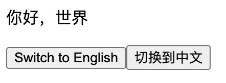
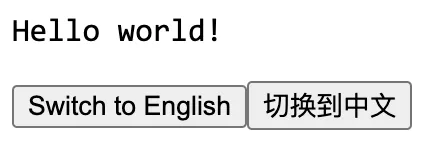
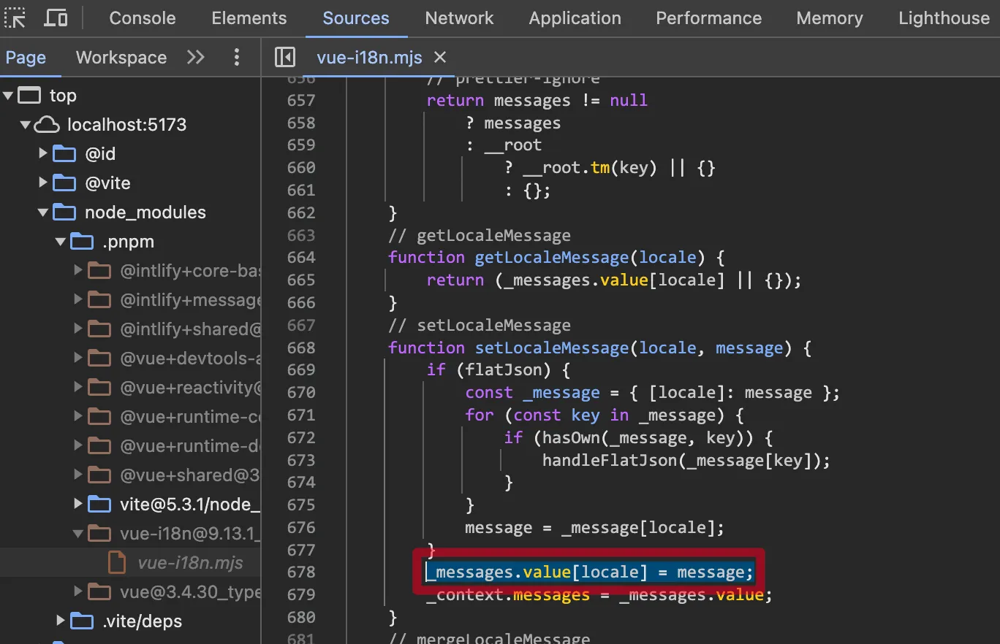

# [0019. i18n 的 message 缓存机制](https://github.com/Tdahuyou/TNotes.vue/tree/main/notes/0019.%20i18n%20%E7%9A%84%20message%20%E7%BC%93%E5%AD%98%E6%9C%BA%E5%88%B6)

<!-- region:toc -->

- [1. 📝 summary](#1--summary)
- [2. 🔗 links](#2--links)
- [3. 📒 notes](#3--notes)
- [4. 💻 demo](#4--demo)

<!-- endregion:toc -->

## 1. 📝 summary

- `i18n.setLocaleMessage(locale, message)`
- `i18n.locale.value = 'target-lang'`
- 如何实现国际化语言模块的按需加载

## 2. 🔗 links

- https://vue-i18n.intlify.dev/api/composition#setlocalemessage-locale-message - Vue-i18n 官方文档，v9.x 版本，setLocaleMessage(locale, message)。
- https://github.com/vbenjs/vue-vben-admin - Vben Github。在 Vben Admin 中，对国际化模块的处理逻辑，就是采用文中这种按需引入的方式来实现的。

## 3. 📒 notes

i18n 的 messages 缓存机制主要是通过 i18n.setLocaleMessage(locale, message) 这个 API 来实现的。通过这种缓存机制，我们可以仅在必要的时候再去导对应语言的 message，实现 **按需加载** 的效果。

## 4. 💻 demo

```ts
// main.ts
import { createApp } from 'vue'
import { createI18n } from 'vue-i18n'
import App from './App.vue'

const i18n = createI18n({
  legacy: false,
  locale: 'zh-CN',
  fallbackLocale: ['en'],

  messages: {
    // en 由程序运行过程中动态插入到 messages 中
    // en: {
    //   message: {
    //     greeting: 'hello world',
    //   },
    // },
    // zh-CN 是系统默认的语言，首次启动时默认就加载 zh-CN
    'zh-CN': {
      message: {
        greeting: '你好，世界',
      },
    },
  },
})

const app = createApp(App)

app.use(i18n)

app.mount('#app')
```

```vue
<!-- App.vue -->
<script setup lang="ts">
import { useI18n } from 'vue-i18n'

const { locale, messages, setLocaleMessage } = useI18n()
console.log('init', messages.value) // 只有 zn-CN

const switchToZh = () => (locale.value = 'zh-CN')
const switchToEn = () => {
  setLocaleMessage('en', {
    // 动态地插入 en
    message: {
      greeting: 'Hello world!',
    },
  })

  console.log('switchToEn', messages.value) // 含有 zh-CN 和 en
  locale.value = 'en'
}
</script>

<template>
  <div>
    <p>{{ $t('message.greeting') }}</p>
    <button @click="switchToEn">Switch to English</button>
    <button @click="switchToZh">切换到中文</button>
  </div>
</template>
```

**最终效果**

一开始默认显示中文。



点击按钮【Switch to English】切换到英文。



控制台输出内容如下图所示。


---

**分析 setLocaleMessage(locale, message) 的实现**

从 Sources 面板中定位到 `setLocaleMessage(locale, message)` 的源代码，如下图所示，其中核心语句是 `_messages.value[locale] = message`。



从源码上不难看出，每次调用 i18n.setLocaleMessage(locale, message) 的时候，都会将新的 message 插入到已有的 messages 中。通过这种做法，可以有效利用 messages 的缓存，每次系统在切换不同语言的时候，只需要去修改 i18n.locale.value 的值即可。

- 如果 locale 对应的 message 还没有加载过，那么再去动态 import 对应的 xxx-language.json 文件，并将数据解析为 message 格式。
- 反之，如果 locale 已经加载过了，就不再需要去 import 了，直接修改 i18n.locale.value 的值即可。

判断 locale 是否加载过，也是非常简单的一件事儿，一种可行的方案是：在本地维护一个 loadLocalePool 数组，所有加载过的语言都 push 到这个数组中，每次切换语言的时候，检查切换的目标语言是否存在于 loadLocalePool 中即可。

```ts
// loadLocalePool 示例
type LocaleType = 'zh_CN' | 'en' | 'ru' | 'ja' | 'ko'
// LocaleType 中定义系统支持的语言类型

const loadLocalePool: LocaleType[] = []
// 所有加载过的语言都 push 到这个数组中
```
